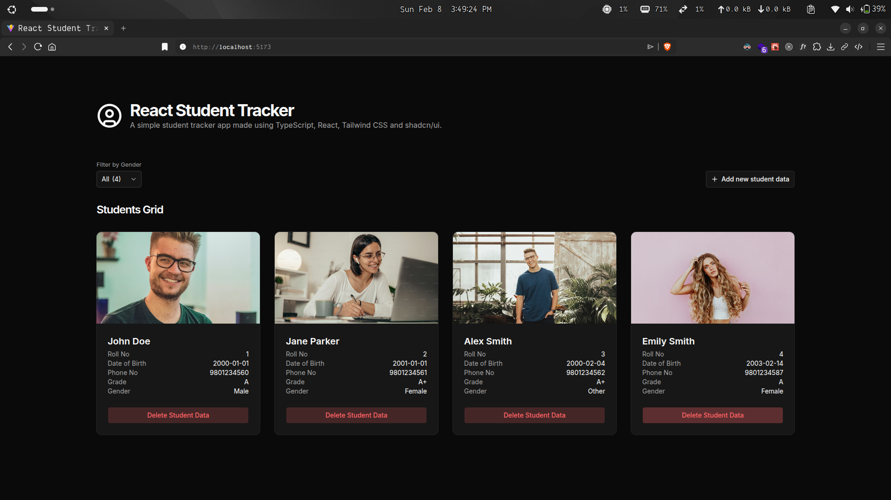
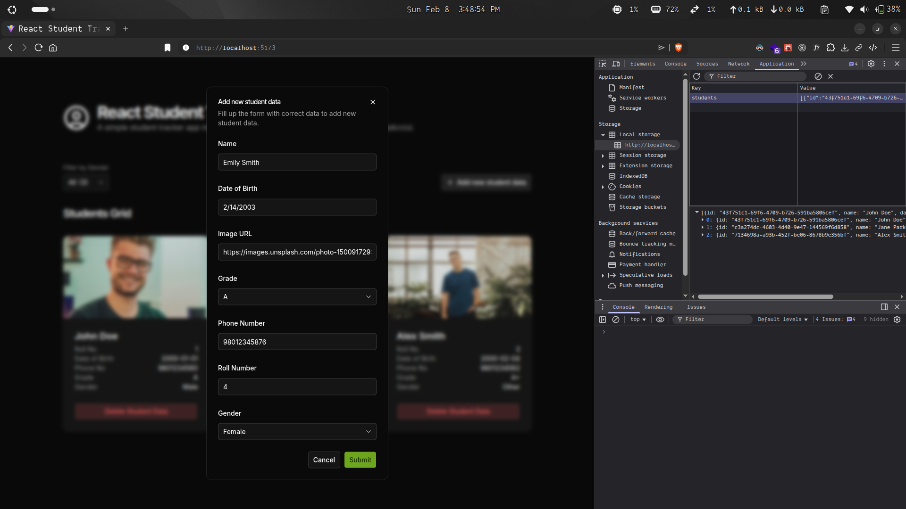

# React Student Tracker

A simple student tracker app made using TypeScript, React, Tailwind CSS and shadcn/ui.

## Tech Stack

- `typescript`
- `react`
- `tailwindcss`
- `shadcn/ui`
- `zod`
- `react-hook-form`

## Features

- Clean UI
- Client input validation using `react-hook-form` and `zod`
- Sync with `localstorage` for data persistence

## Preview

